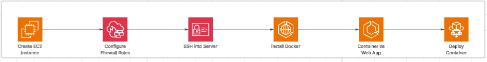

# AWS Portfolio: Containerized React App Deployment

## 📌 Project Overview

This project showcases a **production-ready React web application** deployed on AWS EC2 using Docker and Nginx. It demonstrates modern cloud deployment practices, containerization, and AWS infrastructure setup, making it a strong portfolio piece for DevOps and cloud engineering roles.

---

## 🛠 Tech Stack

- **Frontend:** React (with Vite)
- **Containerization:** Docker
- **Cloud Provider:** AWS (EC2, Security Groups, IAM)
- **Web Server:** Nginx
- **Version Control:** GitHub

---

## 🚀 Features

- Production build of a React app using Vite
- Containerized with Docker and served via Nginx
- Deployed on AWS EC2 with secure port mapping and security group configuration
- Scalable architecture, ready for CI/CD integration
- Professional documentation, architecture diagram, and deployment demo

---

## ⚡ Deployment Steps (High-Level)

1. **Create EC2 Instance**
   - Launch an EC2 instance (Amazon Linux/Ubuntu recommended)
   - Configure Security Groups to allow HTTP (port 80) and SSH (port 22) access

2. **Install Docker & Docker Compose**
   - SSH into your EC2 instance and install Docker:
     ```sh
     sudo apt update
     sudo apt install docker.io -y
     sudo systemctl start docker
     sudo systemctl enable docker
     ```
   - (Optional) Install Docker Compose if needed

3. **Build and Run the Docker Image**
   - Clone your repository and navigate to the project directory
   - Build the Docker image:
     ```sh
     docker build -t react-app .
     ```
   - Run the container, mapping port 80:
     ```sh
     docker run -d -p 80:80 react-app
     ```

4. **Access the Application**
   - Visit your EC2 instance's public IP in a browser to view the deployed app

---

## 🎥 Demo Video

[▶️ Watch the Deployment Walkthrough](https://www.loom.com/share/54cae3d026ee4cdba301550d39cea550?sid=6eb369be-3f63-44f5-a5ed-ea7caf72e719)


---

## 🗺️ Architecture Diagram

  
*React → Docker → EC2 → Internet*  
*(Attach your diagram image or link here. Tools: draw.io, Excalidraw, Lucidchart)*

---

## 🖼️ Screenshots

- App running in browser
- Docker container logs
- EC2 instance dashboard

*Attach your screenshots here as you collect them.*


## 💡 Challenges, Resolutions & Business Value

### 🔹 Challenge 1: Containerizing the React App

- **Issue:** Initial Docker build failed because the build artifacts weren’t copied correctly into the Nginx container.
- **Resolution:** Used a multi-stage Dockerfile — first to build the React app with Vite, then copied the production-ready `/build` folder into an Nginx image. This reduced the image size and ensured static files were served efficiently.
- **Business Value:** Optimized image size → faster deployments, reduced infrastructure costs, and reliable production performance.

---

### 🔹 Challenge 2: EC2 Network Access

- **Issue:** After running the container, the app wasn’t accessible from the browser.
- **Resolution:** Configured AWS Security Groups to allow inbound HTTP (port 80) traffic. Verified with `docker ps` and public IP testing.
- **Business Value:** Ensured proper access controls → balancing security with usability. Demonstrates ability to configure cloud networking securely.

---

### 🔹 Challenge 3: Persistent Deployment & Scalability

- **Issue:** The container would stop on instance restarts. This would cause downtime.
- **Resolution:** Used `-d` flag (detached mode) and enabled Docker service to start on boot. Prepared the setup so it could be extended later with Docker Compose or an orchestration tool like ECS/Kubernetes.
- **Business Value:** Increased availability and reliability of the application → critical for any production workload.

---

### 🔹 Challenge 4: Professional Documentation & Demonstration

- **Issue:** A working app is valuable, but without proper documentation and a demo, the project has little portfolio impact.
- **Resolution:** Added structured README, architecture diagram, and video walkthrough.
- **Business Value:** Communicates technical ability to both technical and non-technical stakeholders → a key skill for DevOps and Cloud Engineers.

---

## 📚 Extra Notes

- For production, consider using a domain name and HTTPS (SSL/TLS)
- Explore CI/CD integration with GitHub Actions or AWS CodePipeline for automated deployments
- Monitor and scale your EC2 instance as needed

---

**Feel free to fork this repo and use it as a template for your own AWS
